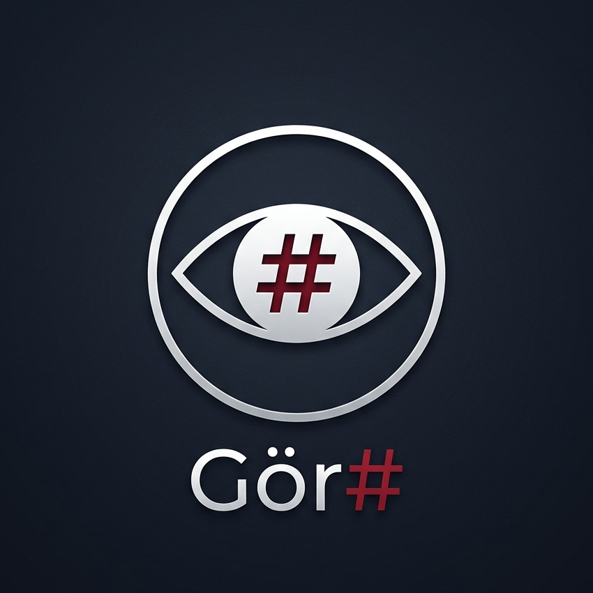

#  Gör# (GörSharp)

**Başlangıç seviyesindeki geliştiriciler için C# öğrenimini daha anlaşılır ve daha erişilebilir hâle getiren bir eğitim dili.**

*A beginner-friendly educational language designed to make learning C# clearer and more accessible.*

Gör#, programlamaya yeni başlayanlar için tasarlanmış bir eğitim dilidir.
Değişkenler, koşullar, döngüler ve fonksiyonlar gibi temel C# kavramlarını daha okunabilir bir sözdizimiyle gösterir; böylece öğrenen kişi hem yazdığı ifadeyi hem de bunun C# karşılığını birlikte görebilir.

[](https://github.com/JnRMnT/gorscharp/actions)
[](https://dotnet.microsoft.com/)
[](LICENSE)

## Kaynak Kod Dönüştürme Nedir?

Bir kaynak dosyayı, davranışını koruyarak başka bir dilde yeni bir kaynak dosyaya çevirme işlemine `transpile` denir.
Gör# bunu eğitim amacıyla kullanır: yazdığınız `.gör` dosyasından okunabilir bir `.cs` dosyası üretir ve öğrenme sürecinde iki dil arasındaki ilişkiyi görünür kılar.

## Hızlı Başlangıç

```bash
# Klonla
git clone https://github.com/JnRMnT/gorscharp.git
cd gorsharp

# Derle
dotnet build GorSharp.slnx

# Bir .gör dosyasını C# koduna dönüştür
dotnet run --project src/GorSharp.CLI -- transpile samples/01-merhaba.gör

# Doğrudan çalıştır
dotnet run --project src/GorSharp.CLI -- run samples/01-merhaba.gör
```

## Örnek — Doğal Türkçe Akış

```gör
öğrenciAdı: metin "Ayşe" olsun;
vize: sayı 40 olsun;
final: sayı 55 olsun;
devamDurumu: mantık evet olsun;

fonksiyon ortalamaHesapla(v: sayı, f: sayı): sayı {
  döndür v + f;
}

toplam: sayı ortalamaHesapla(vize, final) olsun;

eğer devamDurumu ve toplam 90'dan büyük veya eşit ise {
  öğrenciAdı yazdır;
  " AA ile geçti" yeniSatıraYazdır;
} yoksa eğer devamDurumu ve toplam 70'den büyük veya eşit ise {
  öğrenciAdı yazdır;
  " BB ile geçti" yeniSatıraYazdır;
} değilse {
  öğrenciAdı yazdır;
  " tekrar etsin" yeniSatıraYazdır;
}

kalanHafta: sayı 3 olsun;
döngü kalanHafta büyüktür 0 iken {
  "Kalan hafta: " yazdır;
  kalanHafta yeniSatıraYazdır;
  kalanHafta = kalanHafta - 1;
}
```

Bu örnekte doğal dil parçacıkları (`iken`, `ve`, `veya`, `evet`) ile C# öğrenimini destekleyen açık bir akış birlikte kullanılır.

## Basit Örnekler — Diğer Söz Dizimi

Gör#'ın doğal Türkçe ifade yeteneğini gösteren kısa örnekler:

```gör
// Doğal karşılaştırma (ablative numbers)
puan: sayı 85 olsun;
eğer puan 80'den büyük veya eşit ise {
  "Başarılı" yeniSatıraYazdır;
}

// Doğal mantık operatörleri
sınav: mantık doğru olsun;
eğer sınav ve puan 75'den büyük ise {
  "Geçti" yeniSatıraYazdır;
}

// Fonksiyonlar
fonksiyon faktoriyel(n: sayı): sayı {
  eğer n eşittir 1 {
    döndür 1;
  }
  döndür n * faktoriyel(n - 1);
}

// Değişken atama (tür çıkarımı)
sonuç faktoriyel(5) olsun;
sonuç yeniSatıraYazdır;
```

## Özellikler

| Gör# | C# | Durum |
|---|---|---|
| `x 5 olsun;` | `var x = 5;` | ✅ |
| `x: sayı 5 olsun;` | `int x = 5;` | ✅ |
| `x = 10;` | `x = 10;` | ✅ |
| `"Merhaba" yazdır;` | `Console.Write("Merhaba");` | ✅ |
| `eğer` / `yoksa eğer` / `değilse` | `if` / `else if` / `else` | ✅ |
| `döngü koşul { }` | `while (koşul) { }` | ✅ |
| `tekrarla (init; koşul; güncelle) { }` | `for (init; koşul; güncelle) { }` | ✅ |
| `fonksiyon ad(p: tür): dönüş { }` | `static dönüş ad(tür p) { }` | ✅ |
| `döndür` / `kır` / `devam` | `return` / `break` / `continue` | ✅ |
| `ve` / `veya` / `değil` | `&&` / `\|\|` / `!` | ✅ |
| `ya da` / `hem de` | `\|\|` / `&&` | ✅ |
| `evet` / `hayır` | `true` / `false` | ✅ |
| `ise` / `olursa` / `iken` / `mı-mi-mu-mü` | doğal dil parçacıkları | ✅ |
| `eşittir` / `büyüktür` / `küçüktür` | `==` / `>` / `<` | ✅ |
| `90'dan büyük veya eşit` | `>= 90` | ✅ |
| `liste'ye 10 ekle;` | `liste.Add(10);` | 🔄 Planlandı |
| `sınıf` / `kurucu` / `miras` | `class` / `ctor` / inheritance | 🔄 Planlandı |
| `dene` / `hata_varsa` / `sonunda` | `try` / `catch` / `finally` | 🔄 Planlandı |
| `her eleman döngüsü` | `foreach` | 🔄 Planlandı |

> Not: Mevcut uygulanmış dil çekirdeği; değişkenler, ifadeler, koşullar, döngüler, fonksiyonlar ve doğal Türkçe koşul biçimlerine odaklanır. Sonek tabanlı metot çağrıları ve bazı OOP yapıları hâlâ planlanan alandadır.

## Yol Haritası

Yayın stratejisi net: önce Visual Studio deneyimini tamamlamak, ardından aynı yetenekleri VS Code tarafında tam eşlemek.

### Aşama 1 — Visual Studio Önceliği
- VSIX kurulum/çalıştırma akışını sadeleştirme
- Şablonlar, sağ tık dönüştürme ve üretim zincirini kararlı hâle getirme
- Eğitim odaklı tanılama ve araç ipuçlarını Visual Studio içinde derinleştirme

### Aşama 2 — VS Code Eşleme
- Visual Studio'da kararlılaşan özellikleri VS Code uzantısına birebir taşıma
- LSP tabanlı davranışları eşitleme (tamamlama, tanım, yeniden adlandırma, tanılama)
- Dokümantasyon ve örnekleri iki IDE için tek kaynakta birleştirme

### Aşama 3 — Ortak Deneyim
- İki IDE arasında tutarlı eğitim deneyimi
- Daha doğal Türkçe ifade kalıpları ve sonek tabanlı çağrılarda kapsam genişletme
- Daha güçlü semantik analiz ve öğretici hata açıklamaları

## Dil Kuralları

### Sözcük Sırası
- **ÖNY (Özne-Nesne-Yüklem)**: `"Merhaba" yazdır;` (C#'taki `yazdır("Merhaba")` değil)
- **ÖYN alternatif**: Fonksiyon çağrıları için `topla(3, 5)` de desteklenir (C#'a yakın)

### Atama
- `x 5 olsun;` → `var x = 5;` (tür çıkarımı)
- `x: sayı 5 olsun;` → `int x = 5;` (açık tür)
- `x = 10;` → `x = 10;` (yeniden atama)

### Operatörler
`ve` (&&), `veya` (||), `değil` (!), `eşittir` (==), `büyüktür` (>), `küçüktür` (<), `büyükEşittir` (>=), `küçükEşittir` (<=), `eşitDeğildir` (!=)

Doğal Türkçe için şu ek biçimler de desteklenir: `ya da`, `hem de`, `evet`, `hayır`, ayrıca koşullarda `ise`, `olursa`, `iken`, `mı/mi/mu/mü` yok sayılabilir.

Örnek:

```gör
eğer puan 90'dan büyük veya eşit ise {
  "Geçti" yeniSatıraYazdır;
}
```

## Proje Yapısı

```
src/
  GorSharp.Core/            — AST düğümleri, tipler, Sözlük ve tanılama
  GorSharp.Parser/          — ANTLR4 lexer/parser + AST oluşturucu
  GorSharp.Morphology/      — ZemberekDotNet entegrasyonu, SuffixResolver
  GorSharp.Transpiler/      — AST → C# kod üretici
  GorSharp.CLI/             — Konsol uygulaması (transpile/run/diff)
  GorSharp.LanguageServer/  — LSP sunucusu (IDE uzantıları için)
grammar/
  GorSharp.g4               — ANTLR4 dilbilgisi (dil tanımı)
dictionaries/
  sozluk.json               — Anahtar kelime/tür/metot eşleştirmeleri
tests/                      — xUnit test projeleri
samples/                    — Örnek .gör dosyaları
docs/                       — Dil belgeleri
```

## Yerelde Kullanım

### Gereksinimler
- [.NET 10.0 SDK](https://dotnet.microsoft.com/download)

### Başlangıç

Projeyi bilgisayarınızda çalıştırmak, örnek dosyaları denemek ve üretilen C# kodunu görmek için yalnızca .NET 10.0 SDK yeterlidir.

### Derleme ve Test

```bash
dotnet build GorSharp.slnx
dotnet run --project src/GorSharp.CLI -- transpile samples/01-merhaba.gör
dotnet run --project src/GorSharp.CLI -- run samples/01-merhaba.gör
```

## Geliştiriciler ve Katkı Verenler İçin

### Gereksinimler
- [.NET 10.0 SDK](https://dotnet.microsoft.com/download)
- Test çalıştırma, parser tarafında geliştirme yapma ve çözümü tamamen derleme için kaynak kodun tamamı gerekir.
- Java yalnızca `grammar/GorSharp.g4` değiştiğinde ANTLR çıktısını yeniden üretmek için gerekir. Bu durumda [Oracle JDK 21+](https://www.oracle.com/java/technologies/downloads/) veya [OpenJDK 21+](https://openjdk.org/projects/jdk/21/) kullanabilirsiniz.

### Derleme ve Test

```bash
dotnet build GorSharp.slnx
dotnet test GorSharp.slnx
```

### Dilbilgisi Değişikliği

`grammar/GorSharp.g4` dosyasını düzenleyin. ANTLR parser'ı derleme sırasında otomatik olarak yeniden üretilir; bu adım için sisteminizde Java 21+ kurulu olmalıdır.

## Katkıda Bulunma

[CONTRIBUTING.md](CONTRIBUTING.md) dosyasına bakın.

## İlgili Belgeler

- [docs/dil-belirtimi.md](docs/dil-belirtimi.md) — güncel dil kuralları ve örnekler
- [docs/başlangıç-visual-studio.md](docs/başlangıç-visual-studio.md) — Visual Studio kurulumu ve çalışma akışı
- [docs/ide-destek-karsilastirma.md](docs/ide-destek-karsilastirma.md) — VS Code / Visual Studio IDE desteği özeti

## Lisans

MIT — [LICENSE](LICENSE) dosyasına bakın.
